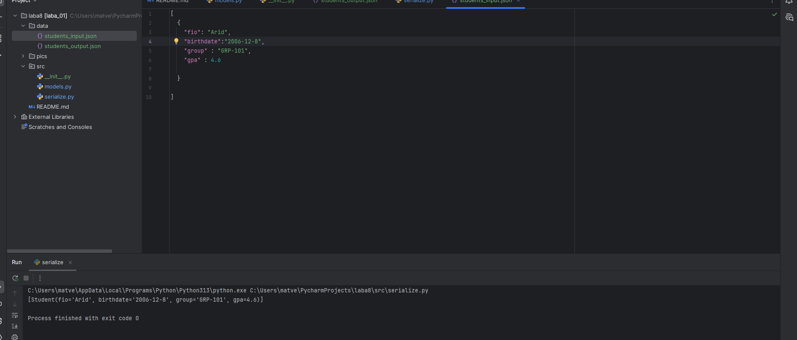
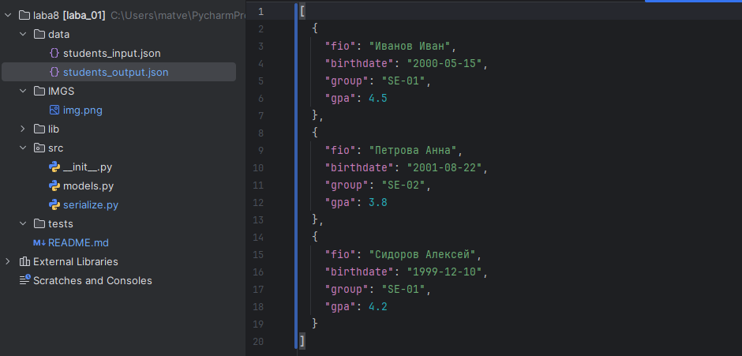

# Лабораторная работа №8
## models.py
```python
from dataclasses import dataclass
from datetime import datetime, date
import json
from typing import Dict, Any


@dataclass
class Student:
    fio: str
    birthdate: str
    group: str
    gpa: float

    def __post_init__(self):
        """Валидация данных после инициализации"""
        try:
            datetime.strptime(self.birthdate, "%Y-%m-%d")
        except ValueError:
            raise ValueError(f"Invalid date format: {self.birthdate}. Use YYYY-MM-DD")

        # Валидация среднего балла
        if not (0 <= self.gpa <= 5):
            raise ValueError(f"GPA must be between 0 and 5, got {self.gpa}")

    def age(self) -> int:
        """Вычисление возраста студента"""
        birth_date = datetime.strptime(self.birthdate, "%Y-%m-%d").date()
        today = date.today()
        age = today.year - birth_date.year

        # Корректировка, если день рождения еще не наступил в этом году
        if today.month < birth_date.month or (today.month == birth_date.month and today.day < birth_date.day):
            age -= 1

        return age

    def to_dict(self) -> Dict[str, Any]:
        """Сериализация объекта в словарь"""
        return {
            "fio": self.fio,
            "birthdate": self.birthdate,
            "group": self.group,
            "gpa": self.gpa
        }

    @classmethod
    def from_dict(cls, data: Dict[str, Any]) -> 'Student':
        """Десериализация объекта из словаря"""
        return cls(
            fio=data["fio"],
            birthdate=data["birthdate"],
            group=data["group"],
            gpa=data["gpa"]
        )

    def __str__(self) -> str:
        """Строковое представление объекта"""
        return f"Студент: {self.fio}, Группа: {self.group}, GPA: {self.gpa}, Возраст: {self.age()} лет"


if __name__ == "__main__":
    try:
        student = Student(
            fio="Иванов Иван Иванович",
            birthdate="2000-05-15",
            group="SE-01",
            gpa=4.5
        )
        print(student)
        print(f"Словарь: {student.to_dict()}")
    except ValueError as e:
        print(f"Ошибка: {e}")


```
## Задание B - CSV → XLSX
```python
import json
from src.models import Student
import argparse


def students_to_json(students: list[Student], path: str) -> None:
    data = [student.to_dict() for student in students]  # Генератор списка: преобразуем каждый объект Student в словарь

    with open(path, 'w', encoding='utf-8') as f:
        json.dump(data, f, ensure_ascii=False, indent=2)


def students_from_json(path: str) -> list[Student]:  # Десериализация списка студентов из JSON файла
    try:
        with open(path, 'r', encoding='utf-8') as f:
            data = json.load(f)  # Загрузка и парсинг JSON данных из файла в Python

        students = []
        for item in data:
            try:
                student = Student.from_dict(item)  # Создание объекта Student из словаря
                students.append(student)
            except (ValueError, KeyError) as e:
                print(f"Ошибка при создании студента из данных {item}: {e}")
                continue

        return students
    except FileNotFoundError:
        print(f"Файл {path} не найден")
        return []
    except json.JSONDecodeError:
        print(f"Ошибка декодирования JSON из файла {path}")
        return []


if __name__ == "__main__":  # Проверка: запущен ли скрипт напрямую (
    # Пример использования
    students = [
        Student("Иванов Иван", "2000-05-15", "SE-01", 4.5),
        Student("Петрова Анна", "2001-08-22", "SE-02", 3.8),
        Student("Сидоров Алексей", "1999-12-10", "SE-01", 4.2)
    ]

    # Сериализация
    students_to_json(students, r"C:\Users\matve\PycharmProjects\laba8\data\students_output.json")

    # Десериализация
    loaded_students = students_from_json(r"C:\Users\matve\PycharmProjects\laba8\data\students_input.json")
    for student in loaded_students:
        print(student)

```  
### тесты




